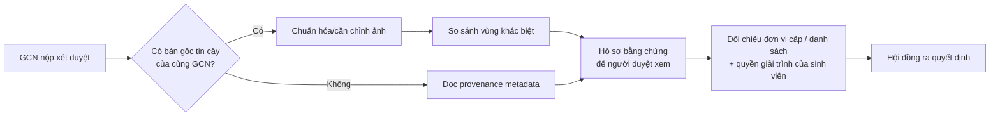

# Meeting brief — GCN Evidence Review

Tài liệu này giúp trình bày dự án trong 15–20 phút với Giảng viên Khoa Hệ thống Thông tin. Nó phân biệt rõ phần đã chạy, giả thuyết nghiên cứu và các quyết định cần xin định hướng. Không dùng tài liệu này để khẳng định một GCN là giả hoặc một sinh viên đã gian lận.

## 1. Thông điệp mở đầu — 90 giây

> Dự án của em là một prototype hỗ trợ Hội đồng rà soát minh chứng GCN trong đợt xét danh hiệu Sinh viên 5 tốt. Bài toán em muốn hỗ trợ không phải “một mô hình AI tự phán xét giấy thật hay giả”, mà là giúp người duyệt nhìn thấy sớm các bằng chứng kỹ thuật cần đối chiếu: khác biệt so với tài liệu gốc đáng tin cậy, hoặc dấu vết xuất xứ số còn trong file.
>
> Vì quyết định ảnh hưởng trực tiếp đến quyền lợi sinh viên, hệ thống chỉ gắn cờ để Hội đồng kiểm tra lại. Kết luận cuối cùng thuộc về con người và, khi cần, phải đối chiếu nguồn cấp hoặc cho sinh viên giải trình.
>
> Phiên bản hiện tại chạy hai phép kiểm tra cục bộ trong trình duyệt: đọc metadata/provenance và so sánh pixel với một **bản gốc của cùng GCN đã cấp**. Em muốn xin định hướng để nghiên cứu bước tiếp theo: chuẩn hóa ảnh chụp, đối chiếu nội dung và tìm các nhóm tài liệu bất thường mà không tạo báo động nhầm.

## 2. Điều cần nói chính xác về baseline hiện tại

| Thành phần | Hệ thống hiện làm gì | Hệ thống chưa làm gì |
| --- | --- | --- |
| Metadata/provenance | Đọc marker C2PA/JUMBF, IPTC và một số chuỗi EXIF/XMP về generator/model | Chưa xác minh chữ ký C2PA, asset binding hoặc trust chain; không có marker không chứng minh ảnh thật |
| `reference-pixel-diff` | Chuẩn hóa raster, bù dịch chuyển nhỏ, đánh dấu vùng có khác biệt RGB vượt ngưỡng và xuất SHA-256/báo cáo | Chưa đọc chữ, chưa xử lý xoay/crop/phối cảnh, chưa xác định AI hay người đã sửa, chưa benchmark trên GCN thật |
| Privacy hiện tại | Hai luồng trên xử lý file trong browser; không có API upload ảnh trong repo này | Đây không phải cam kết cho mọi tính năng tương lai, server, OCR provider hay cloud clustering |

**Điểm phải giữ khi demo:** pixel diff không được so với “phôi trống” để kết luận về tên, ngày hoặc số hiệu. Một GCN hợp lệ vốn khác phôi trống ở các trường cá nhân hóa. Baseline chỉ phù hợp khi có bản xuất gốc đáng tin cậy của đúng GCN đó, hoặc về sau có vùng bất biến/vùng dữ liệu đã xác thực để so sánh có kiểm soát.

Các ngưỡng đang dùng (`RGB > 28`, tile `16×16`, bù dịch chuyển tối đa 12 px) là heuristic kỹ thuật, chưa phải ngưỡng đã kiểm chứng. Vì vậy chỉ nói “vùng khác biệt cần xem lại”, không nói “đã phát hiện giả mạo”.

## 3. Câu chuyện kỹ thuật nên kể

Metadata là tín hiệu bổ sung: có khai báo AI là lý do để xem kỹ hơn; thiếu metadata là `unknown`. Đối chiếu ảnh gốc là tín hiệu mạnh hơn khi nguồn gốc của ảnh gốc được xác minh. Cả hai đều không thay thế xác minh từ đơn vị ban hành.

## 4. So sánh các hướng nghiên cứu

| Hướng | Trả lời câu hỏi nào? | Giá trị cho GCN | Rủi ro/giới hạn | Khuyến nghị |
| --- | --- | --- | --- | --- |
| OCR + đối soát danh sách | Tên, ngày, số hiệu có khớp nguồn cấp không? | Gần trực tiếp với tính hợp lệ nghiệp vụ | OCR tiếng Việt, dấu và ảnh nén có lỗi; lỗi OCR không phải lỗi sinh viên | Ưu tiên khi có danh sách hoặc API/nguồn cấp tin cậy |
| ORB + RANSAC + homography | Ảnh chụp nghiêng/có phối cảnh có thể nắn về ảnh gốc không? | Giảm `inconclusive` trước pixel diff | GCN ít texture, ảnh mờ/crop có thể thiếu điểm khớp; cần ngưỡng inlier và quyền từ chối căn chỉnh | Nghiên cứu kế tiếp trước khi đổi sang cloud |
| pHash | Đây có phải bản gần trùng/ứng viên cùng ảnh nguồn? | Lọc nhanh ứng viên, hỗ trợ tìm ảnh gần giống hoặc cùng mẫu | Hash toàn ảnh chịu nén để tìm tương đồng nên có thể bỏ qua sửa chữ nhỏ; không tự định vị vùng sửa; nearest-neighbor không mặc định là `O(1)` | Dùng để **candidate retrieval**, không dùng làm bằng chứng gian lận |
| Image embedding + clustering | Tập hồ sơ có các nhóm bố cục nào, file nào lạc cụm? | Hỗ trợ tìm “khác mẫu cần xem lại” khi có đủ mẫu cùng tổ chức/cuộc thi/năm/hạng | Embedding thiên về tương đồng thị giác/ngữ nghĩa, không đáng tin để kết luận font/tên bị sửa; mẫu nhỏ hoặc nhiều mẫu hợp lệ sẽ lạc cụm | Chỉ là triage, cần stratify và benchmark |
| Metadata/C2PA | File còn dấu vết nguồn gốc nào? | Bằng chứng phụ nhanh khi còn nguyên file | Scanner hiện chưa xác minh C2PA; dữ liệu dễ mất sau nén/screenshot | Giữ như lớp bằng chứng phụ |

### ORB/pHash không phải “thay OCR”

ORB là feature detector/descriptor để ghép các điểm đặc trưng; khi đủ match tốt, RANSAC có thể ước lượng homography rồi nắn ảnh ứng viên về mặt phẳng ảnh gốc. Nó phục vụ **căn chỉnh**, không đọc tên/số hiệu và không phát hiện AI. OpenCV mô tả ORB là bộ keypoint detector/descriptor; việc ước lượng homography phải được chặn khi không đủ inlier hoặc biến đổi phi lý. [OpenCV ORB](https://docs.opencv.org/4.13.0/javadoc/org/opencv/features2d/ORB.html)

pHash tạo fingerprint chịu được một số biến đổi nhỏ để truy hồi ảnh gần giống. Chính ưu điểm “chịu được nén/blur” làm nó không phù hợp để một mình tìm các thay đổi chữ nhỏ. Với tập phôi lớn, nó có thể rút tập đối chiếu xuống vài ứng viên trước khi chạy ORB/pixel diff. [pHash design notes](https://www.phash.org/docs/design.html)

### Embedding + cloud clustering là một giả thuyết, không phải cam kết privacy

TensorFlow.js có thể chạy mô hình vision và lấy embedding trên thiết bị, nhưng “trích vector ở client” không biến vector thành dữ liệu vô danh hay vô hại. Vector vẫn được suy ra từ ảnh và có thể chứa thông tin về bố cục, chữ, con dấu hoặc con người trong ảnh. Nếu gửi vector lên cloud, cần xem nó là một luồng xử lý dữ liệu: xác định người kiểm soát, mục đích, tập trường dữ liệu, thời hạn lưu, phân quyền, mã hóa, audit và cơ chế xóa. [TensorFlow.js models](https://www.tensorflow.org/js/models)

Nếu nghiên cứu hướng này, output đúng là: **“cụm thiểu số/cần xác minh thêm”**, không phải “GCN giả”. Chỉ gom trong cùng `(đơn vị cấp, cuộc thi, năm, hạng, loại bản xuất)`; bỏ qua nhóm không đủ mẫu; và luôn có người duyệt trước bất kỳ tác động bất lợi nào.

## 5. Kinh nghiệm DAM AKIA: nên và không nên mang vào cuộc họp

Bạn có thể nói:

> Trong công việc DAM, em đã thấy pHash và embedding hữu ích để giảm không gian tìm kiếm, gợi ý ảnh tương tự và đưa trường hợp mơ hồ vào hàng đợi review. Điều em muốn học hỏi để áp dụng cho GCN là cách xây dựng reference corpus, version hóa model/vector space, giữ audit trail và thiết kế cơ chế fail-closed khi điểm tương đồng không đủ rõ. Em không coi similarity là bằng chứng định danh hoặc là kết luận tự động.

Đây là liên hệ đúng vì DAM AKIA đang tách pHash, embedding, Vision và human review thành các lớp riêng. Hệ thống chỉ coi tương đồng là đề xuất review; thay model hoặc tiền xử lý phải version hóa lại vector space. Đây là bài học rất tốt cho benchmark GCN.

Không nói trong meeting rằng kiến trúc DAM có thể bê nguyên sang GCN, hoặc trình bày chi tiết vận hành nội bộ, dữ liệu kho ảnh, nhà cung cấp, cấu hình, code hay thông tin khách hàng. Bối cảnh khác hoàn toàn: DAM được thiết kế để lưu và phục vụ tài sản truyền thông; GCN chứa dữ liệu của sinh viên, nên data minimization và quyền giải trình phải chặt hơn.

## 6. Ba quyết định cần xin ý kiến Thầy/Cô

1. **Định nghĩa ground truth:** Khoa/Hội có thể cung cấp bản gốc của đúng GCN, danh sách/số hiệu ban hành, hay chỉ có phôi mẫu? Mỗi loại nguồn hỗ trợ một phép kiểm khác nhau.
2. **Thiết kế benchmark:** Nên bắt đầu với bao nhiêu mẫu được phép sử dụng và những biến thể nào: nén, scan, chụp nghiêng, sửa tên/ngày/số hiệu bằng tay và bằng AI? Mục tiêu false positive nào mới chấp nhận được cho pilot?
3. **Kiến trúc dữ liệu:** Ưu tiên toàn bộ local/on-device, hay một xử lý tập trung được Hội đồng quản trị dữ liệu rõ ràng? Nếu có cloud, data-flow và quy trình xin phép phải được duyệt trước khi làm.

## 7. Câu hỏi phản biện và câu trả lời ngắn

**“Có phải pixel diff phát hiện được mọi GCN giả?”**  
Không ạ. Nó chỉ tìm sai khác vượt ngưỡng so với tài liệu gốc đáng tin cậy, và có thể sai khi ảnh bị nén, scan, crop, đổi góc hoặc khi thay đổi quá nhỏ. Em sẽ đo false positive/false negative trên benchmark trước khi đề xuất pilot.

**“Tại sao không dùng ngay AI detector?”**  
Vì bài toán cần bằng chứng giải thích được và có chi phí báo động nhầm cao. Em ưu tiên đối chiếu với nguồn cấp, dữ liệu nội dung và provenance trước. Detector AI chỉ đáng tích hợp sau khi có benchmark độc lập trên GCN Việt Nam, hiệu chuẩn và cơ chế từ chối kết luận.

**“Mất metadata qua Zalo thì sao?”**  
Hệ thống trả `unknown`, không trừ điểm. Khi đó cần dùng bản gốc, đối chiếu nguồn cấp hoặc yêu cầu bản xuất ban đầu theo quy trình của Hội đồng.

**“Cloud embedding có đảm bảo riêng tư không?”**  
Không thể nói là đảm bảo chỉ vì cloud không nhận file ảnh. Embedding vẫn là dữ liệu phát sinh từ ảnh. Nếu theo hướng này, em sẽ coi nó là một xử lý dữ liệu mới, thiết kế governance và xin phê duyệt trước; chưa đưa vào prototype.

**“C2PA có chứng minh ảnh thật không?”**  
Không. C2PA là bằng chứng provenance có chữ ký và binding khi được xác minh đúng cách; ngay cả provenance hợp lệ cũng không tự chứng minh nội dung tài liệu là đúng. Scanner hiện tại mới đọc dấu vết, chưa xác minh chuỗi đó. [C2PA Explainer](https://c2pa.org/specifications/specifications/2.2/explainer/Explainer.html)

## 8. Agenda 20 phút

1. **2 phút:** Bài toán, nguyên tắc DSS và vì sao false positive là rủi ro lớn.
2. **5 phút:** Demo hai tính năng đang chạy; chỉ ra một tình huống `unknown`/`inconclusive` để chứng minh hệ thống biết từ chối kết luận.
3. **4 phút:** Nêu đúng giới hạn: bản gốc cùng chứng nhận, metadata chưa xác minh chữ ký, chưa OCR/homography/AI detector, chưa benchmark.
4. **5 phút:** Trình bày bảng so sánh ORB, pHash, OCR và embedding; đề xuất ORB/homography + benchmark là bước kế tiếp ít rủi ro nhất.
5. **4 phút:** Xin ý kiến cho ba quyết định ở mục 6.

## 9. Checklist trước buổi gặp

- Không nói “100%”, “chắc chắn AI”, “không thể bypass”, “vector không phải dữ liệu cá nhân” hoặc “pHash lookup O(1)” như một fact chung.
- Không nói Nghị định 13/2023/NĐ-CP là căn cứ duy nhất. Tài liệu mới nên tham chiếu Luật Bảo vệ dữ liệu cá nhân số 91/2025/QH15 và Nghị định 356/2025/NĐ-CP, đều có hiệu lực từ 01/01/2026. [Luật 91/2025/QH15](https://vanban.chinhphu.vn/?docid=214590&pageid=27160), [Nghị định 356/2025/NĐ-CP](https://vanban.chinhphu.vn/?docid=216387&pageid=27160)
- Sửa mọi chỗ ghi “Web Workers” nếu mô tả baseline hiện tại: Canvas/pixel comparison hiện chạy main thread, chưa có worker/cancel thực sự.
- Đem theo 1 ca bản gốc/candidate giống nhau, 1 ca khác biệt được tạo có kiểm soát, 1 ca nén hợp lệ, và 1 ca `unknown` metadata. Không dùng GCN thật hoặc dữ liệu cá nhân khi chưa có quyền sử dụng.
- Chuẩn bị một trang benchmark proposal: nguồn dữ liệu, quyền sử dụng, nhãn vùng sửa, loại biến thể, precision/recall/FPR/IoU, tỷ lệ `inconclusive`, thời gian xử lý và khoảng tin cậy.

## 10. Kết thúc nên nói

> Em mong Thầy/Cô góp ý để biến prototype từ một công cụ kỹ thuật có giải thích thành một quy trình thẩm định có trách nhiệm: nguồn tham chiếu rõ, benchmark rõ, data-flow rõ và con người luôn là bên kết luận.

